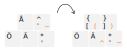

# Nordic keyboard layouts for programming

This is a collection of keyboard layout modifications which change the Finnish, Swedish, Norwegian and Danish keyboard layouts to programming friendlier alternatives. The layout brings parts of the US keyboard layout into the Nordic keyboard layout to make programming-specific special characters more accessible, such as the brackets and curly braces.

Featured layouts:
- finnish_dev_layout: For Finnish speaking Finns. Sacrifices the `Å` and scarcely used `¨` key to support US like bracket/braces keys. Also adds a more convenient `AltGr+Å` and `AltGr+¨` to create parenthesis. Moves caret and tilde to AltGr+ä and AltGr+' respectively. 
- swedish_dev_layout: Does not compromise Å character. TODO

## Installation (Windows, native layout install)
1. Download layout installer from the releases page
1. Install
1. Go to Settings -> Time and Language -> Language tab
1. Select your language from the Preferred languages list and press the _Option_ button to open the settings for that language
1. Add the installed keyboard for that language
1. You can now either _Override the default input method_ with the new layout from Language -> Keyboard settings or use the language bar from the notification area to switch keyboard layouts

### Uninstalling the native Windows keyboard layout
1. TODO

## Installation (Windows, AutoHotKey)

Requirements:
The Windows keyboard modifications use AutoHotKey which needs to be installed from https://www.autohotkey.com/

1. Clone this repo (or download the raw .ahk script of your choosing from Github)
1. Create a shortcut from the .ahk layout modification you want to use: Open right-click menu -> "Create shortcut"
1. Press Win+R to open the Run prompt, launch "shell:startup" to open the startup folder
1. Move the shortcut into the folder. It should now load when Windows starts up.

## Installation (macOS)
TODO